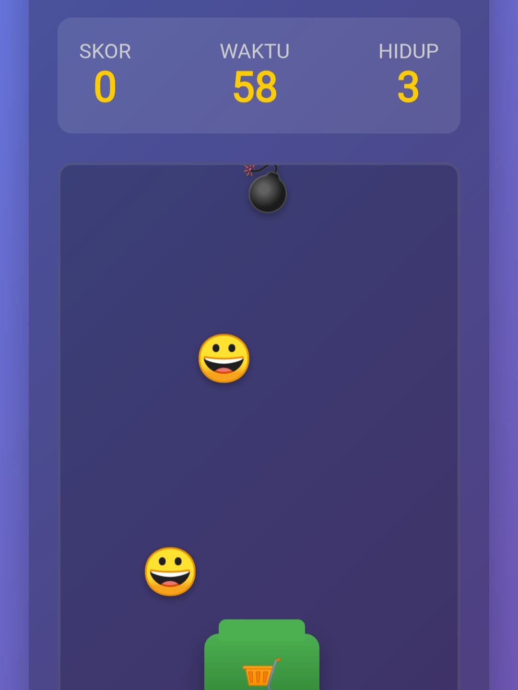

# Web-Have-Fun
<html lang="id">
<head>
  <meta name="google-site-verification" content="df6EtL6mKtOPWlg4bi57__R4cjbLIAuNwZisuD42fHo" />
  <title>Fun Web by LeafZuya (Daffa)</title>
  
  <link rel="icon" href="Favicon.ico" type="image/x-icon">
<link rel="icon" href="favicon.png" type="image/png">

<!-- 🌿 Untuk Android dan Chrome -->
<link rel="apple-touch-icon" sizes="180x180" href="https://leafzuya.github.io/Web_Pertama_Ku/favicon.png">
<link rel="manifest" href="https://leafzuya.github.io/Web_Pertama_Ku/manifest.json">
<!-- 🌐 SEO Meta Tags -->
<meta name="title" content="LeafZuya Web — Have Fun">
<meta name="description" content="LeafZuya Website khusus untuk orang-orang yang sedang mencari kesenangan di waktu luang 🌿💙">
<meta name="keywords" content="LeafCy, LeafZuya, AI Chat, Virtual Friend, Artificial Intelligence, Blue Archive Inspired, Web AI Indonesia, Web Have Fun, Karya Anak Gabut">
<meta name="author" content="LeafZuya (Daffa)">

<!-- 📱 Open Graph (Facebook, Discord, Google Rich Preview) -->
<meta property="og:title" content="LeafZuya Web — Have Fun">
<meta property="og:description" content="Website ini dibuat hanya karena kegabutan LeafZuya — dan sekadar hobi di waktu luang 😆">
<meta property="og:image" content="https://leafzuya.github.io/Web_Pertama_Ku/Favicon.png">
<meta property="og:type" content="website">
<meta property="og:url" content="https://leafzuya.github.io/Web_Pertama_Ku/">
<meta property="og:locale" content="id_ID">

<!-- 🐦 Twitter Card -->
<meta name="twitter:card" content="summary_large_image">
<meta name="twitter:title" content="LeafZuya Web — Have Fun">
<meta name="twitter:description" content="Website buatan LeafZuya (Daffa), dibuat hanya untuk bersenang-senang 🌿✨">
<meta name="twitter:image" content="https://leafzuya.github.io/Web_Pertama_Ku/Favicon.png">
<meta name="twitter:creator" content="@LeafZuya">
  
</head>
<body>
  <header>
    
    <h1>🌟 Welcome to My First Web 🌟</h1>
    
Dibuat oleh LeafZuya (Daffa) 😎🤭

    
🍀

    
✨

    
💙

  </header>

  <!-- Gelembung Hijau + Biru -->
  

  

  

  

  

  <main class="container">
    

      <h2>✨ Tentang 🍀</h2>
      
Website ini dibuat cuma buat have fun aja, bukan serius. Jadi enjoyyy 😙

    
       Kirim kritik dan saran kalian ke <a href="mailto: kingglafeon@gmail.com">Gmail Ku [LeafZuya(Daffa)]....hehehe...🥳</a>

         

  <a href="https://trakteer.id/leafzuya%28daffa%29" target="_blank">
    <button style="
      background: linear-gradient(135deg, #ff4e50, #f9d423);
      border: none;
      padding: 15px 35px;
      border-radius: 40px;
      color: white;
      font-size: 1.2rem;
      font-weight: bold;
      cursor: pointer;
      box-shadow: 0 5px 15px rgba(0,0,0,0.2);
      transition: all 0.3s ease;">
      🍵 Bagi yang mau Traktir......buat Beli Laptop ♥️🥳
    </button>
  </a>

  <!-- Tombol -->
<button onclick="playMusic()">Jangan Pencet Aku....☠️🗿</button>

<!-- Audio -->
<audio id="myAudio" src="Jokowi.mp3"></audio>
<!-- ganti "music/bgmusic.mp3" sesuai lokasi file MP3 kamu -->

<b>JANGAN COBA-COBA SCREENSHOOT CODE QR DIBAWAH INI,LALU MEMINDAI NYA DI PEMINDAI QR CODE 🗿☠️💀</b>

     
    

    

      <h2>📘 Pelajaran Favorit</h2>
      
Matematika & Informatika 💚💙 Karena Melatih Berpikir Kritis dalam menyelesaikan Sesuatu Masalah...!!!!! hehe...gak jelas ah...

    

    

      <h2>🎮 Hobi 🎶</h2>
      
Main game, coding iseng-iseng, dan punya mimpi jadi Indie GameDev 🥳🤞

    

    

      <h2>📺 Video Random</h2>
      <iframe width="220" height="220" src="https://www.youtube.com/embed/hyd8vfuQta0"
      title="YouTube video player" frameborder="0"
      allow="accelerometer; autoplay; clipboard-write; encrypted-media; gyroscope; picture-in-picture" allowfullscreen></iframe>

      <iframe width="220" height="220" src="https://www.youtube.com/embed/nhUVc_9ki44"
      title="YouTube video player" frameborder="0"
      allow="accelerometer; autoplay; clipboard-write; encrypted-media; gyroscope; picture-in-picture" allowfullscreen></iframe>
    

    

      <h2>Penasaran Karya Danang...?, Klik Dibawah Ini ya...!😋</h2> 
      
   <a href="https://leafzuya.github.io/Khusus_Danang/">Klik aku untuk melihat berbagai Karya Buatan Danang.....😆</a> 

   <a>Jangan Lupa Follow Akun Media Sosialnya...!!</a> 
   
  <a href="https://tiktok.com/@zainaki_and_hoshino">Media Sosial Danang </a>
    

     <!-- === TIC TAC TOE: Player vs AI (paste this inside <main class="container">) === -->

  <h2>🎯 Tic-Tac-Toe — Player vs AI</h2>
  
Pilih sisi & tingkat kesulitan, lalu kalahkan AI kalau bisa 😎

  <!-- Controls -->
  

    <label> Kamu main:
      <select id="ttt-side" style="padding:6px 10px; border-radius:10px; border:1px solid #9acdff;">
        <option value="X">❌ X</option>
        <option value="O">⭕ O</option>
      </select>
    </label>
    <label> Kesulitan:
      <select id="ttt-difficulty" style="padding:6px 10px; border-radius:10px; border:1px solid #9acdff;">
        <option value="easy">Easy</option>
        <option value="medium">Medium</option>
        <option value="hard">Hard</option>
        <option value="impossible" selected>Impossible 😈</option>
      </select>
    </label>
    <button id="ttt-new">🔁 New</button>
    <button id="ttt-undo">↩️ Undo</button>
    <button id="ttt-hint">💡 Hint</button>
  

  <!-- Board -->
  

    <!-- cells generated by JS -->
  

  <!-- Status + Score -->
  
Status: siap!

  
Skor — Kamu: 0 | AI: 0 | Seri: 0

  <!-- Styles scoped -->
  

  <!-- Logic -->
  

<!-- === /TIC TAC TOE === -->

      <h2>Tangkap Emoji....!!😎🥳😵</h2>
  
dibawah ini,hanya Ilustrasi gambar...jadi,percuma Di-Klik² berapa kali pun 

  
      <a href="https://leafzuya.github.io/Web-Have-Fun-/">Klik aku untuk Mainkan...!!!,Kalo kalah, Berarti Noob😎☝️</a>
  
Cara mainnya tinggal di Klik ke kanan atau ke kiri aja,lalu tangkap semua dan kumpulkan point sebanyak-banyaknya.....!!!(Hanya disediakan 3 Nyawa/Kesempatan)

    

    

      <h2>Sound Memory....!!🗣️🎤🎧</h2>
      
dibawah ini,hanya Ilustrasi gambar...jadi,percuma Di-Klik² berapa kali pun 

      
   
     
  <a href="https://leafzuya.github.io/Sound-Memori-/">Klik aku untuk Mainkan sound memori...!!!,Kalo cepat kalah, Berarti jangan main ini lagi,main sana game Roblox 🤓☝️</a>
  
Cara mainnya tinggal ikuti irama yang muncul acak dan pencet tombol sesuai irama yang muncul pada tombol tersebut.....semakin lama akan semakin banyak irama yang akan di putar/mainkan..... Semangat....!!!🥳♥️🔥

    

    

      <h2>Kalkulator LeafZuya 😆🌿➗➖➕</h2>
      
dibawah ini,hanya Ilustrasi gambar...jadi,percuma Di-Klik² berapa kali pun 

      
      <a href="https://leafzuya.github.io/Kalkulator-/">Klik aku untuk Menjalankan Kalkulator,versi Buatan ku sendiri.....</a>
  
Konon katanya,orang yang menggunakan Kalkulator Ini,bisa menambahkan IQ Manusia Maksimal sampai 105....🗿👍

    

    

      <h2>LeafCy AI😆🌿</h2>
      
dibawah ini,hanya Ilustrasi gambar...jadi,percuma Di-Klik² berapa kali pun 

      
  
     
      <!-- 🌿 Tombol Unik Hijau-Biru -->
<a href="https://leafzuya.github.io/Chat-With-LeafCy/" class="magic-btn">Kunjungi LeafCy AI☘️😆</a>

  
Jangan Lupa Klik Tombol Diatas yah....Itu adalah AI Buatan ku Sendiri (LeafZuya),tapi masih Tahap Pengembangan (Beta)...kalian juga bisa Tambahkan Obrolan dan Jawaban Obrolan Nya...Bareng LeafCy 😆🤞☘️🍃

    

    

      <h2>Leaf-Wheel🎡🌿</h2>
      
dibawah ini,hanya Ilustrasi gambar...jadi,percuma Di-Klik² berapa kali pun 

      
  
     
      <!-- 🌿 Tombol Unik Hijau-Biru -->
<a href="https://leafzuya.github.io/Leaf_Wheel/" class="magic-btn">Kunjungi Leaf-Wheel☘️🎡</a>

  
Butuh Roda Penentu Keberuntungan???, Cobain Leaf-Wheel Yukkk!!!!🗿🙏☘️🎡

    

    

      <h2>Cek Hewan Dalam Jiwa Kalian!!🌿</h2>
      
dibawah ini,hanya Ilustrasi gambar...jadi,percuma Di-Klik² berapa kali pun 

      
  
     
      <!-- 🌿 Tombol Unik Hijau-Biru -->
<a href="https://leafzuya.github.io/Cek-Hewan-/" class="magic-btn">Kunjungi Cek Hewan Dalam Jiwa ☘️✅🗿</a>

  
Apakah Kalian Sering Bertanya Dalam Hati"Sebenarnya, Apasih Hewan/Khodam Dalam Diri ku ini?"...Nahh,untuk itu, Kunjungi Minigame Diatas,untuk Memecahkan Rasa Penasaran Kamu...🗿🙏☕

    

    

      <h2>LeafPy!🐦🌿</h2>
      
<b>SEDANG DALAM PERBAIKAN!!!</b>

      
  
     
      <!-- 🌿 Tombol Unik Hijau-Biru -->
<a href="https://leafzuya.github.io/LeafPy/23" class="magic-btn">Sedang Dalam Perbaikan ☕🗿🍃🐦</a>

  
Kalian Suka Tantangan Skor Paling Banyak Dengan Orang lain Di Seluruh Dunia???,Nahhh...kalian Datang Di tempat yang Tepat,Di LeafPy,Kalian Bisa Mengumpulkan Skor sebanyak-banyaknya dengan cara melewati Rintangan Pipa Merah!!!, Minigame Ini juga Dilengkapi Leaderboard Online Mengandalkan Lokal Storage Browser....(Butuh Waktu 5 Hari Woilah Baru Selesai 🗿🙏☕)

    

    
    <!-- Tombol menuju halaman Tentang -->
<button id="aboutBtn" class="btn-about">ℹ️ Tentang(Opsional,tapi Disarankan 🗿☕)</button>

<!-- Halaman Tentang (disembunyikan awalnya) -->
<section id="aboutPage" class="about-page">
  

    <h2>🌿 LeafZuya Web Have Fun</h2>
    

      Website ini dibuat sebagai hiburan Di Waktu Luang,Jangan Terlalu Fokus/Serius pada Website ini,Hidup kalian lebih berwarna,jika kalian melakukan Hal-Hal yang Bermanfaat untuk Orang lain dan Diri Sendiri...Ingat!,kita Ini Makhluk Yang Lemah!,Jangan Sombong kepada sang Pencipta!,Karena Dialah yang Berkuasa atas Dunia Ini,dan Jangan Lupa <b>BERBUAT BAIK</b> 💚.
    

    <ul>
      
      <li><b>🧩 Versi:</b> v1.3 — "Daun Mekar"</li>
      <li><b>💬 Dibuat oleh:</b> LeafZuya(Daffa)</li>
    </ul>

    

      ✨ Catatan Developer: 
      "Ubahlah Waktu Luang Kalian Yang Tidak Bermanfaat,Menjadi <b>SEDIKIT</b> lebih Bermanfaat"
    

    <li><b>📅 Update terakhir:</b> 22 Oktober 2025</li>
      <h1> •Apa Yang Baru?</h1>
    
-Perbaikan Bug

    
-Update Minigame <b>TANGKAP EMOJI</b>

    
-Update Minigame <b>KALKULATOR LEAFZUYA</b>

    
-Perbaikan Bug Pada <b>LEAFCY AI</b>

    
-Penambahan Minigame <b>CEK HEWAN DALAM JIWA</b>

   
Penambahan Minigame <b>LEAFPY </b>

    
    

    <button id="backBtn" class="btn-back">⬅️ Kembali</button>
  

</section>

  <footer>
  © 2025 Fun Web by LeafZuya. Jangan Copyright...!! dan Jangan Lupa 
  <b>BERNAFAS</b> 🤭🗣️🔥 
  🍀
  💚
  💙
   
</footer>

